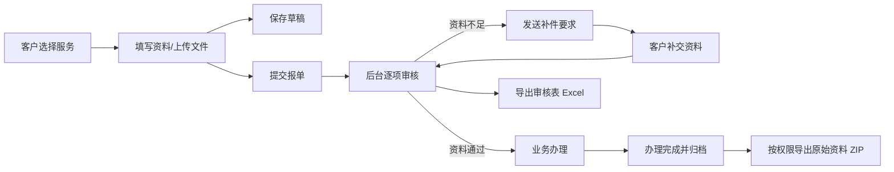
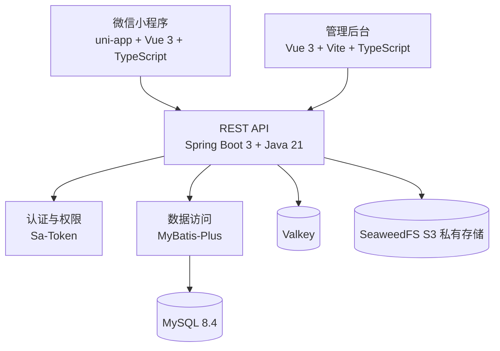

# 万企商服通开发文档总览

> 文档版本：V1.0  
> 编制日期：2026-09-23  
> 适用项目：万企商服通  
> 目标主体：衡阳市长全科技有限公司

## 1. 文档目的

本文档是万企商服通的开发入口，用于统一产品范围、技术架构、工程目录、环境配置、研发流程和交付标准。详细规范见：

- [数据库设计规范](./01_数据库设计规范.md)
- [后端设计与开发规范](./02_后端设计与开发规范.md)
- [前端设计与开发规范](./03_前端设计与开发规范.md)
- [API 接口设计](./04_API接口设计.md)
- [后端实现与 Review 报告](./05_后端实现与Review报告.md)
- [完整数据库增量脚本](../database/002_full_schema.sql)

## 2. 产品范围

万企商服通是面向已合作企业客户的报单与资料协作系统，不是商城、贷款撮合平台或开放式获客平台。

### 2.1 小程序端

| 编号 | 页面 | 主要职责 |
| --- | --- | --- |
| M01 | 首页 | 三类服务入口、当前报单 |
| M02 | 服务选择 | 服务详情、资料数量、隐私提示 |
| M03 | 贸易增量资料清单 | 完整展示 11 项资料及状态 |
| M04 | 开票与附件 | 8 项开票信息、文件上传和失败重试 |
| M05 | 简表单 | 知识产权、资质申报仅填写 3 项信息 |
| M06 | 我的报单 | 办理进度、补件说明、个人中心 |

### 2.2 管理后台

| 编号 | 页面 | 主要职责 |
| --- | --- | --- |
| B01 | 数据工作台 | 指标、趋势、待办和最近报单 |
| B02 | 报单管理 | 查询、筛选、分配和状态管理 |
| B03 | 产品管理 | 服务、资料模板、排序和上下架 |
| B04 | 客户资料 | 资料完成度、Excel/ZIP 独立入口 |
| B05 | 资料审核 | 贸易增量 11 项资料逐项审核 |
| B06 | 导出中心 | Excel/ZIP 生成、预览和下载日志 |

## 3. 三类服务的数据边界

### 3.1 贸易增量

固定包含以下 11 项：

1. 营业执照图片。
2. 开票信息：公司名称、税号、联系地址、联系电话、法定代表人、公司邮箱、开户行网点、基本户账号。
3. 法人身份证照片扫描件并盖公章。
4. 无欠税证明。
5. 税务局开票额度截图，截图需包含右上角公司名称及右下角实时日期。
6. 网银限额截图。
7. 网银余额大于 1000 元截图。
8. 法人征信报告。
9. 企业征信报告。
10. 企业办公室照片及视频。
11. 水母报告链接。

### 3.2 知识产权和资质申报

仅收集：

1. 法人姓名。
2. 公司名称。
3. 联系电话。

不得复用贸易增量的身份证、征信、网银或开票资料模板。

## 4. 业务主流程



### 4.1 报单状态

| 状态值 | 中文名称 | 说明 |
| --- | --- | --- |
| `DRAFT` | 草稿 | 尚未正式提交 |
| `PENDING_REVIEW` | 待审核 | 已提交，等待后台审核 |
| `NEED_SUPPLEMENT` | 待补资料 | 后台已提出补件要求 |
| `PROCESSING` | 处理中 | 资料满足要求，进入业务办理 |
| `COMPLETED` | 已完成 | 办理完成并归档 |
| `CANCELED` | 已取消 | 经授权取消，不物理删除 |

允许的主状态流转：

```text
DRAFT -> PENDING_REVIEW
PENDING_REVIEW -> NEED_SUPPLEMENT | PROCESSING | CANCELED
NEED_SUPPLEMENT -> PENDING_REVIEW | CANCELED
PROCESSING -> COMPLETED | NEED_SUPPLEMENT | CANCELED
```

已完成报单原则上不可回退。如确需纠正，由管理员创建变更记录，不直接篡改历史日志。

## 5. 技术架构



### 5.1 目标技术清单

| 层级 | 技术 | 用途 |
| --- | --- | --- |
| 小程序 | uni-app、Vue 3、TypeScript、Pinia | 客户报单、上传和进度查看 |
| 管理后台 | Vue 3、Vite、TypeScript、Pinia、Vue Router | 运营、审核和导出 |
| 后端 | Spring Boot 3.4、Java 21 | REST API 与业务逻辑 |
| 权限 | Sa-Token | 管理端和小程序端登录态、权限校验 |
| ORM | MyBatis-Plus | 数据访问与分页 |
| 接口文档 | SpringDoc OpenAPI | Swagger/OpenAPI 文档 |
| Excel | EasyExcel | 客户导入、审核表导出 |
| 数据库 | MySQL 8.4 | 业务数据和文件元数据 |
| 缓存 | Valkey | 会话、验证码、幂等和短时任务状态 |
| 文件 | SeaweedFS S3 | 图片、PDF、Excel、视频的私有存储 |

## 6. 当前工程现状

必须区分“已经实现”和“目标设计”。

| 模块 | 当前状态 | 下一阶段 |
| --- | --- | --- |
| 高保真设计 | 已完成 12 页及 PDF | 作为页面实现和验收依据 |
| 小程序 | 仅首页骨架和 Mock 数据 | 拆分 M01–M06，接入真实 API |
| 管理后台 | 单页高保真骨架和 Mock 数据 | 引入路由、Pinia、API 层和权限 |
| 后端 | 认证、企业、产品、报单、文件、审核、导入导出、通知和审计已实现 | 重启 Windows 后执行容器集成验收 |
| 数据库 | 6 张骨架表 + 20 张增量表，共 26 张 | 重启后在空 MySQL 8.4 容器实跑脚本 |
| 文件服务 | 已接入 SeaweedFS S3 私有桶、受控预览和访问日志 | 重启后执行真实上传/删除集成测试 |
| 缓存 | 已接入 Sa-Token、登录限流、幂等和任务协调 | 重启后执行 Valkey 集成测试 |

## 7. 工程目录约定

```text
wqsf/
├─ apps/
│  ├─ client-uni/          # 微信小程序
│  ├─ admin-web/           # 管理后台
│  └─ design-preview/      # 高保真预览与产品说明书源文件
├─ services/
│  └─ api/                 # Spring Boot API
├─ database/
│  ├─ 001_init.sql         # 早期骨架表
│  └─ 002_full_schema.sql  # 完整业务增量结构
├─ infra/
│  └─ docker-compose.yml   # MySQL、Valkey、SeaweedFS
├─ docs/                   # 开发文档
│  ├─ 06_后端维护与Bug定位手册.md
│  ├─ 07_工程目录与修改导航.md
│  └─ changes/             # 每次修改的独立记录和索引
└─ README.md
```

## 8. 本地开发环境

### 8.1 必需工具

- JDK 21。
- Maven 3.9 或更高版本。
- Node.js 20 LTS 或更高版本。
- pnpm 10。
- Docker Desktop。
- HBuilderX：正式微信小程序包建议使用标准 DCloud 环境编译。

### 8.2 启动基础设施

```powershell
cd infra
docker compose up -d
docker compose ps
```

首次启动会执行数据库脚本。已有数据库需要按顺序执行 `001_init.sql`、`002_full_schema.sql`。

### 8.3 启动后端

```powershell
cd services/api
.\mvnw.cmd spring-boot:run
```

默认端口为 `8080`，Swagger 地址为：

```text
http://127.0.0.1:8080/swagger-ui.html
```

### 8.4 启动前端

```powershell
cd apps/client-uni
pnpm install
pnpm dev:h5

cd ../admin-web
pnpm install
pnpm dev
```

## 9. 配置和密钥规范

代码仓库不得提交下列真实值：

- 微信 `AppSecret`。
- 数据库生产密码。
- SeaweedFS/S3 访问密钥。
- 手机号、身份证、征信、银行账号原文。
- 生产环境签名密钥或加密主密钥。

本地使用环境变量或未纳入版本管理的 `.env.local`：

```text
MYSQL_HOST
MYSQL_PORT
MYSQL_DATABASE
MYSQL_USER
MYSQL_PASSWORD
VALKEY_HOST
VALKEY_PORT
S3_ENDPOINT
S3_ACCESS_KEY
S3_SECRET_KEY
S3_BUCKET
WECHAT_APP_ID
WECHAT_APP_SECRET
DATA_ENCRYPTION_KEY
```

## 10. Git 与开发流程

1. 从主分支创建功能分支：`feature/<模块>-<说明>`。
2. 先完成数据库/API 设计，再实现接口和页面。
3. 一个提交只解决一个明确问题。
4. 禁止提交真实客户资料、构建缓存和本地密钥。
5. 合并前至少完成静态检查、单元测试、生产构建和核心流程冒烟测试。

推荐提交前缀：

```text
feat: 新功能
fix: 缺陷修复
docs: 文档
refactor: 不改变行为的重构
test: 测试
chore: 工具或依赖调整
```

## 11. 联调顺序

1. 登录和当前用户。
2. 服务目录和资料模板。
3. 创建草稿、保存表单、提交报单。
4. 文件上传和资料完成度。
5. 后台报单列表与逐项审核。
6. 客户补件与状态同步。
7. Excel 客户导入。
8. Excel 审核表和 ZIP 资料包导出。
9. 敏感资料访问日志和操作日志。

## 12. 测试与验收基线

### 12.1 后端

- 核心 Service 必须有单元测试。
- 状态流转、权限判断和导出任务必须覆盖异常场景。
- Controller 使用 MockMvc 验证参数、权限和响应结构。
- 数据库迁移必须在空库和已有 `001` 骨架库各验证一次。

### 12.2 前端

- TypeScript 不允许无说明地使用 `any`。
- 上传失败、空数据、无权限、接口超时必须可见且可恢复。
- 小程序在 390×844 设计基准下无内容溢出。
- 后台在 1440px 宽度下无横向截断。

### 12.3 安全

- 未授权用户无法通过猜测 URL 访问私有文件。
- 普通 Excel 不包含身份证、征信、网银等原件。
- ZIP 导出必须校验独立权限并记录日志。
- 日志不得输出令牌、完整手机号、身份证号、银行账号和文件签名地址。

## 13. 完成定义（Definition of Done）

一个功能只有同时满足以下条件才算完成：

- 页面、接口和数据库结构与文档一致。
- 参数校验、错误提示和权限校验完整。
- 敏感操作有审计记录。
- 正常、空数据、失败和无权限状态均已处理。
- 后端测试通过，前端生产构建通过。
- OpenAPI、开发文档和状态枚举已同步更新。
