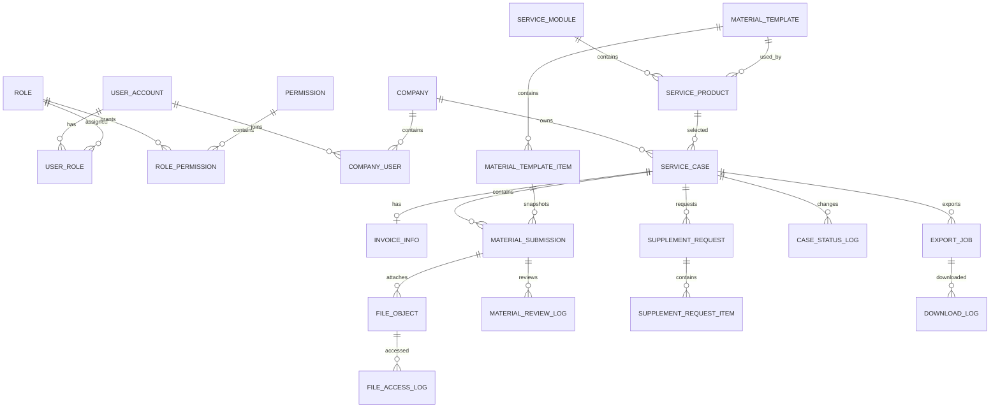

# 万企商服通数据库设计规范

> 数据库：MySQL 8.4  
> 字符集：`utf8mb4`  
> 排序规则：`utf8mb4_0900_ai_ci`  
> 时区：`Asia/Shanghai`

## 1. 设计目标

数据库设计覆盖以下能力：

- 小程序用户、后台用户和角色权限。
- 企业客户和企业成员关系。
- 三类服务产品及可版本化资料模板。
- 报单、开票信息、11 项资料、审核和补件。
- 私有文件元数据与敏感资料访问记录。
- Excel 客户导入、Excel 审核表和 ZIP 资料包导出。
- 消息通知、状态变更和操作审计。

数据库不保存文件二进制。图片、PDF、Excel 和视频存入 SeaweedFS S3 私有桶，数据库只保存对象键和业务关系。

## 2. 设计原则

### 2.1 KISS 原则

- 使用单库单体结构，不提前拆分微服务数据库。
- 主键统一使用 `BIGINT UNSIGNED`。
- 金额使用 `DECIMAL`，禁止使用浮点数；当前业务暂不需要金额字段。
- 状态使用可读英文常量，不使用无法理解的数字魔法值。
- 不把所有业务数据塞入一个 JSON 字段；只有筛选条件快照、扩展配置等非核心结构允许使用 JSON。

### 2.2 逻辑外键

本项目不创建数据库物理外键，关联完整性由 Service 事务保证，原因如下：

- 便于批量导入、归档和后续表结构迁移。
- 与 MyBatis-Plus 和常见 RuoYi 系工程保持一致。
- 避免删除或归档时形成不可控的级联操作。

每个逻辑外键都必须建立普通索引，并在代码中验证关联对象存在。

### 2.3 不物理删除核心业务数据

- 企业、产品、报单采用 `deleted_at` 软删除或状态停用。
- 文件删除先标记 `DELETED`，再由定时任务清理对象存储。
- 审核日志、状态日志、访问日志和下载日志只归档，不提供业务端删除接口。

## 3. 命名规范

| 对象 | 规范 | 示例 |
| --- | --- | --- |
| 表 | 小写蛇形，使用单数名词 | `service_case` |
| 字段 | 小写蛇形 | `company_name_snapshot` |
| 主键 | `id` | `id BIGINT UNSIGNED` |
| 逻辑外键 | `<对象>_id` | `company_id` |
| 唯一索引 | `uk_<表缩写>_<字段>` | `uk_case_no` |
| 普通索引 | `idx_<表缩写>_<字段>` | `idx_case_status` |
| 布尔值 | `TINYINT(1)`，以 `is_` 开头 | `is_sensitive` |
| 时间 | `_at` 结尾，使用 `DATETIME(3)` | `submitted_at` |
| 日期 | `_date` 结尾 | `expire_date` |
| 哈希 | `_hash` 结尾 | `contact_phone_hash` |
| 密文 | `_cipher` 结尾 | `basic_account_cipher` |
| 掩码值 | `_mask` 结尾 | `basic_account_mask` |

禁止使用 MySQL 保留字作为表名或字段名。

## 4. 通用字段规范

业务主表按需要包含：

```sql
id BIGINT UNSIGNED NOT NULL AUTO_INCREMENT,
created_by BIGINT UNSIGNED NULL,
created_at DATETIME(3) NOT NULL DEFAULT CURRENT_TIMESTAMP(3),
updated_by BIGINT UNSIGNED NULL,
updated_at DATETIME(3) NOT NULL DEFAULT CURRENT_TIMESTAMP(3)
  ON UPDATE CURRENT_TIMESTAMP(3),
version INT UNSIGNED NOT NULL DEFAULT 0,
deleted_at DATETIME(3) NULL
```

- `version` 用于 MyBatis-Plus 乐观锁。
- 不需要修改的日志表只保留 `created_at`。
- 所有时间由后端生成或数据库默认生成，前端时间不作为可信审计时间。

## 5. 核心实体关系



## 6. 表清单

### 6.1 用户与权限

| 表名 | 用途 |
| --- | --- |
| `user_account` | 小程序与后台统一账号 |
| `role` | 角色 |
| `permission` | 菜单、按钮和数据操作权限 |
| `user_role` | 用户角色关联 |
| `role_permission` | 角色权限关联 |
| `company_user` | 小程序用户与企业关系 |

### 6.2 产品与模板

| 表名 | 用途 |
| --- | --- |
| `service_module` | 贸易增量、知识产权、资质申报 |
| `service_product` | 可配置的具体服务 |
| `material_template` | 资料模板及版本 |
| `material_template_item` | 模板字段或资料项 |

### 6.3 报单与审核

| 表名 | 用途 |
| --- | --- |
| `company` | 企业客户主数据 |
| `service_case` | 报单主表和提交快照 |
| `invoice_info` | 贸易增量 8 项开票信息 |
| `material_submission` | 报单资料项快照与当前审核结果 |
| `material_review_log` | 每次资料审核的不可变日志 |
| `supplement_request` | 一次补件要求 |
| `supplement_request_item` | 补件涉及的资料项 |
| `case_status_log` | 报单状态流转记录 |

### 6.4 文件、导入导出与审计

| 表名 | 用途 |
| --- | --- |
| `file_object` | 私有文件元数据 |
| `file_access_log` | 敏感文件预览和下载日志 |
| `import_job` | Excel 客户导入任务 |
| `import_job_error` | 导入失败行与原因 |
| `export_job` | Excel/ZIP 导出任务 |
| `download_log` | 导出文件下载记录 |
| `notification` | 客户和后台通知 |
| `operation_log` | 后台业务操作审计 |

## 7. 关键表设计

### 7.1 `user_account`

| 字段 | 类型 | 必填 | 说明 |
| --- | --- | --- | --- |
| `account_type` | `VARCHAR(16)` | 是 | `ADMIN` / `CLIENT` |
| `username` | `VARCHAR(64)` | 否 | 后台用户名，客户端可为空 |
| `password_hash` | `VARCHAR(255)` | 否 | BCrypt/Argon2 哈希，不保存明文 |
| `wechat_openid` | `VARCHAR(128)` | 否 | 小程序 OpenID |
| `wechat_unionid` | `VARCHAR(128)` | 否 | 可选 UnionID |
| `display_name` | `VARCHAR(64)` | 是 | 展示姓名 |
| `phone_cipher` | `VARCHAR(512)` | 否 | 手机号密文 |
| `phone_hash` | `CHAR(64)` | 否 | 标准化手机号 SHA-256，用于精确查找 |
| `phone_mask` | `VARCHAR(32)` | 否 | 如 `138 **** 0000` |
| `status` | `VARCHAR(16)` | 是 | `ENABLED` / `DISABLED` / `LOCKED` |
| `last_login_at` | `DATETIME(3)` | 否 | 最近登录时间 |

唯一约束：后台用户名、小程序 OpenID、手机号哈希分别唯一，但允许空值。

### 7.2 `company`

在现有表基础上补充：

- 法人姓名、企业邮箱、详细地址。
- 联系电话密文、哈希和掩码。
- 客户来源、启用状态、乐观锁和软删除。
- 统一社会信用代码继续作为企业去重依据；页面展示时必须脱敏。

### 7.3 `service_module`

固定初始化三条记录：

| `module_code` | 名称 | 说明 |
| --- | --- | --- |
| `TRADE_INCREMENT` | 贸易增量 | 使用 11 项资料模板 |
| `IP` | 知识产权 | 使用 3 字段简表单 |
| `QUALIFICATION` | 资质申报 | 使用 3 字段简表单 |

### 7.4 `material_template` 与 `material_template_item`

模板采用“发布后不可修改，修改即新建版本”的方式：

- `material_template.template_code`：稳定业务编码。
- `version_no`：从 1 递增。
- `status`：`DRAFT` / `PUBLISHED` / `ARCHIVED`。
- 产品只引用一个已发布模板版本。

模板项关键字段：

| 字段 | 说明 |
| --- | --- |
| `item_code` | 如 `BUSINESS_LICENSE`、`INVOICE_INFO` |
| `item_name` | 客户看到的资料名称 |
| `input_type` | `FILE` / `TEXT` / `URL` / `FORM_GROUP` |
| `is_required` | 是否必填 |
| `is_sensitive` | 是否敏感资料 |
| `allowed_extensions` | 如 `jpg,jpeg,png,pdf` |
| `max_file_size_mb` | 单文件大小上限 |
| `max_file_count` | 最大文件数量 |
| `help_text` | 填写或上传说明 |
| `sort_order` | 展示顺序 |

贸易增量模板必须初始化 11 条；知识产权和资质申报模板分别初始化法人姓名、公司名称、联系电话三条文字字段。

### 7.5 `service_case`

报单保存提交时快照，防止企业或产品后续改名影响历史记录：

| 字段 | 说明 |
| --- | --- |
| `case_no` | 唯一业务编号，如 `BD20260921001` |
| `company_id` | 企业逻辑外键 |
| `product_id` | 服务产品逻辑外键 |
| `service_type` | 服务模块快照 |
| `company_name_snapshot` | 提交时企业名称 |
| `legal_person_name` | 简表单法人姓名快照 |
| `contact_phone_cipher/hash/mask` | 联系电话快照 |
| `applicant_user_id` | 提交人 |
| `assignee_id` | 当前负责人 |
| `status` | 报单状态 |
| `case_month` | 贸易增量业务月份，格式 `YYYY-MM` |
| `submitted_at` | 正式提交时间 |
| `completed_at` | 完成时间 |

报单进度不单独存百分比，默认根据必填 `material_submission` 的已提交数量实时计算，避免数据不一致。

### 7.6 `invoice_info`

一张贸易增量报单最多一条开票信息：

| 字段 | 存储策略 |
| --- | --- |
| 公司名称 | 明文快照 |
| 税号 | 密文 + 掩码 |
| 联系地址 | 明文或按部署要求加密 |
| 联系电话 | 密文 + 哈希 + 掩码 |
| 法定代表人 | 明文或按部署要求加密 |
| 公司邮箱 | 明文 |
| 开户行网点 | 明文 |
| 基本户账号 | 密文 + 掩码 |

密钥不得写入数据库；由部署环境通过 `DATA_ENCRYPTION_KEY` 提供。

### 7.7 `material_submission`

报单创建时，根据模板生成资料项快照。后续模板变更不会影响已有报单。

| 字段 | 说明 |
| --- | --- |
| `template_item_id` | 来源模板项 |
| `material_code/name` | 编码和名称快照 |
| `input_type` | 输入类型快照 |
| `required` | 是否必填快照 |
| `is_sensitive` | 敏感等级快照 |
| `text_value` | 普通文字或 URL；敏感文字不得直接存此字段 |
| `submit_status` | `NOT_SUBMITTED` / `SUBMITTED` / `FAILED` |
| `review_status` | `PENDING` / `PASSED` / `NEED_SUPPLEMENT` / `NOT_REQUIRED` |
| `client_visible_note` | 客户可见审核说明 |
| `internal_note` | 仅后台可见备注 |

文件通过 `file_object.material_id` 关联，不把文件列表写入 JSON。

### 7.8 `file_object`

| 字段 | 说明 |
| --- | --- |
| `bucket_name` | 私有桶名称 |
| `object_key` | 对象键，禁止保存永久公开 URL |
| `original_name` | 原始文件名，仅展示使用 |
| `stored_name` | 服务端生成的安全文件名 |
| `content_type` | 实际 MIME 类型 |
| `extension` | 小写扩展名 |
| `file_size` | 字节数 |
| `sha256` | 完整文件摘要 |
| `status` | `UPLOADING` / `READY` / `FAILED` / `DELETED` |
| `is_sensitive` | 是否敏感 |
| `uploaded_by` | 上传用户 |

推荐对象键：

```text
private/{companyId}/{caseNo}/{materialCode}/{yyyyMMdd}/{uuid}.{ext}
```

对象键不得直接使用客户提供的文件名，防止路径穿越和重名覆盖。

### 7.9 审核与补件

- `material_submission` 保存当前审核结果。
- `material_review_log` 保存每次审核的不可变历史。
- `supplement_request` 表示一次发送给客户的补件通知。
- `supplement_request_item` 表示本次补件涉及哪些资料项。
- `case_status_log` 保存每次报单状态变化及操作者。

同一报单可以多次补件；新补件请求不得覆盖历史补件内容。

### 7.10 Excel 导入

`import_job` 保存：

- 原始 Excel 文件对象 ID。
- 模板版本。
- 总行数、成功数、失败数。
- 任务状态和错误报告文件对象 ID。

`import_job_error` 使用 `row_no` 保存失败行号，同时保存原始数据快照和错误原因。Java 属性 `rowNumber` 通过 MyBatis 显式映射到 `row_no`，避免使用 MySQL 8.4 保留语法。原始数据快照需要脱敏，不保存身份证或完整银行账号。

### 7.11 Excel/ZIP 导出

`export_job.export_type`：

- `REVIEW_EXCEL`：审核情况 Excel，不包含敏感原件。
- `MATERIAL_ZIP`：原始资料包，仅敏感资料导出角色可以创建。

任务状态：

```text
PENDING -> RUNNING -> SUCCEEDED -> EXPIRED
                   -> FAILED
```

下载行为写入 `download_log`。`download_count` 是冗余统计字段，更新时必须与下载日志写入放在同一业务操作中。

## 8. 索引规范

### 8.1 必需索引

- 所有业务编号建立唯一索引。
- 所有逻辑外键建立普通索引。
- 列表常用组合条件建立联合索引。
- 审计表按业务对象和时间建立联合索引。

推荐联合索引：

```text
service_case(company_id, status, created_at)
service_case(assignee_id, status, submitted_at)
material_submission(case_id, review_status)
file_object(case_id, material_id, status)
export_job(operator_id, status, created_at)
operation_log(business_type, business_id, created_at)
```

### 8.2 禁止事项

- 不为低选择性布尔字段单独建立索引。
- 不对大文本字段建立普通 B-Tree 索引。
- 不建立重复索引，例如同时存在 `(case_id)` 和 `(case_id, status)` 时，应根据查询计划判断是否保留前者。
- `%关键词%` 模糊查询数据量增长后应使用专用搜索方案，不持续堆叠普通索引。

## 9. 敏感数据规范

| 数据 | 数据库存储 | 页面展示 | 日志 |
| --- | --- | --- | --- |
| 手机号 | 密文 + 哈希 + 掩码 | 默认掩码 | 只记掩码 |
| 税号 | 密文 + 掩码 | 授权后可查看 | 不记原文 |
| 基本户账号 | 密文 + 掩码 | 默认掩码 | 不记原文 |
| 身份证文件 | 私有对象键 | 受控预览 | 记录访问动作 |
| 征信报告 | 私有对象键 | 受控预览 | 记录访问动作 |
| 网银截图 | 私有对象键 | 受控预览 | 记录访问动作 |

哈希前必须标准化，例如手机号去空格和国家码格式统一。哈希用于精确查询，不能代替加密。

## 10. 事务边界

以下操作必须在事务中完成：

- 创建报单并生成资料项快照。
- 提交报单并写入状态日志。
- 保存审核结果、补件请求和报单状态。
- 导入一行企业及其成员关系。
- 完成导出任务并登记生成文件。

文件上传不能用数据库事务包裹对象存储网络调用。推荐顺序：

1. 校验业务权限。
2. 上传对象存储。
3. 事务写入 `file_object` 和资料状态。
4. 若步骤 3 失败，异步清理孤立对象。

## 11. 数据保留和归档

- 报单、审核和操作日志默认保留期限由企业合规要求确定，不在代码中硬编码。
- 导出文件默认 30 分钟下载有效，过期后标记 `EXPIRED`，对象由定时任务清理。
- 软删除企业前必须确认不存在未完成报单。
- 删除用户账号不删除其历史操作人信息；页面可显示“已停用用户”。

## 12. 数据库变更流程

1. 每次结构变更新增有序 SQL 文件，不回写已在环境中执行的迁移。
2. 文件命名：`NNN_简短说明.sql`。
3. 迁移必须说明是否可回滚、是否锁表和预计影响行数。
4. 生产执行前先在备份恢复库验证。
5. 大表新增非空字段应分为“新增可空字段—回填—加约束”三步。

当前 `002_full_schema.sql` 面向尚未承载真实数据的开发骨架库。若环境已经写入真实数据，执行前必须先编写数据迁移和回滚方案。
